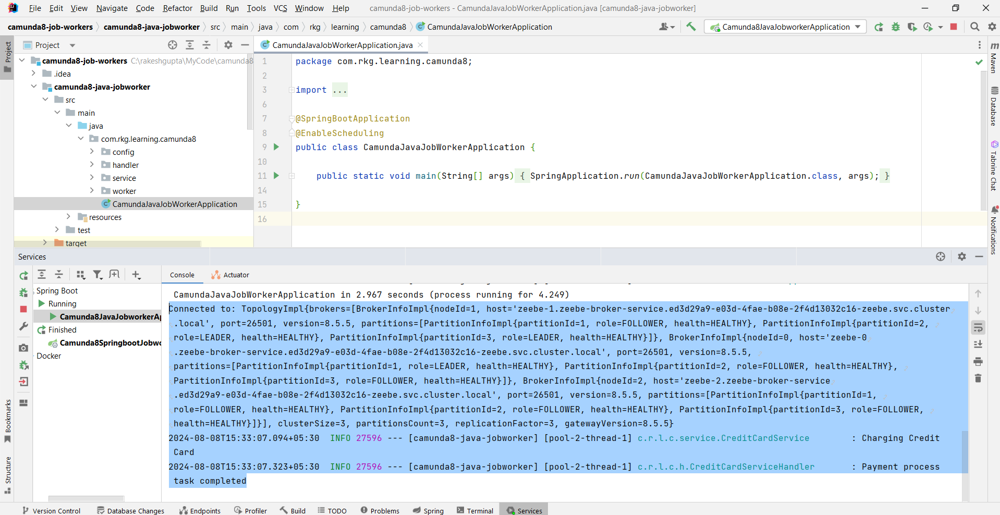

# Spring Boot with Camunda 8 and Zeebe Job Worker

This project demonstrates the integration of [Camunda 8](https://camunda.com/products/camunda-platform/) with a Spring Boot application. It includes examples of using both Java-based and Spring-based Zeebe clients to connect with Camunda 8 SaaS and set up Zeebe job workers.

## Table of Contents

- [Overview](#overview)
- [Features](#features)
- [Prerequisites](#prerequisites)
- [Setup](#setup)
    - [Clone the Repository](#clone-the-repository)
    - [Configure Zeebe Client](#configure-zeebe-client)
    - [Running the Application](#running-the-application)
- [Zeebe Job Worker Setup](#zeebe-job-worker-setup)
    - [Java-based Zeebe Client](#java-based-zeebe-client)
    - [Spring-based Zeebe Client](#spring-based-zeebe-client)

## Overview

This project is built on Spring Boot and integrates Camunda 8, a modern, scalable workflow engine. It provides examples of setting up Zeebe job workers using both Java-based and Spring-based Zeebe clients to connect with Camunda 8 SaaS.

## Features

- **Spring Boot Integration:** Easily integrates Camunda 8 into a Spring Boot application.
- **Zeebe Clients:** Examples of both Java-based and Spring-based Zeebe clients.
- **Job Worker Setup:** Demonstrates the setup of Zeebe job workers to handle tasks from Camunda 8.

## Camunda Zeebe Clients
Camunda 8 offers two types of Zeebe client libraries for interacting with the Zeebe broker:

- **Java Zeebe Client**: A low-level, general-purpose client for programmatic control.

- **Spring Zeebe Client**: A higher-level abstraction built on top of the Java Zeebe Client, providing Spring-specific features for easier integration.

## Prerequisites

- Java 21 or higher
- Maven or Gradle
- Spring Boot 3.3.2
- Camunda 8 SaaS account (You can sign up for a free account [here](https://camunda.com/get-started/))

## Setup

### Clone the Repository

```bash
git clone https://github.com/rakeshkumargupt/camunda8-job-workers.git
cd camunda8-job-workers
```

## Running the Application

```bash 
mvn spring-boot:run
```

### Sample Output:





## Deployment and Testing

- **Deploy a Zeebe Worker:**
Within your Camunda 8 SaaS environment, follow the instructions to deploy a new Zeebe worker. Specify the same worker name as defined in your application.properties file.

## Start a Process:

- Trigger a process in Camunda 8 that includes a service task targeted at your Zeebe worker. Observe the logs in your application's console as the worker receives and processes jobs.

